# Advanced E-Commerce Customer & Revenue Intelligence Platform

End-to-end analytics on the Brazilian E-Commerce Public Dataset by Olist — revenue drivers,
product and category performance, customer value and churn risk, channel proxies, statistical
testing, revenue forecasting, and an interactive BI dashboard, all translated into business
recommendations.

Focus: **data analysis, SQL, statistics and BI** — machine learning only where it earns its place.

<p>
  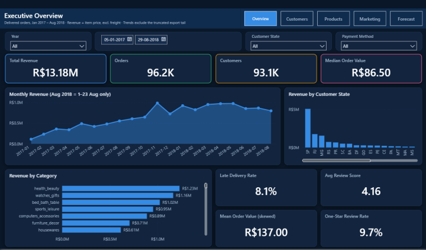
  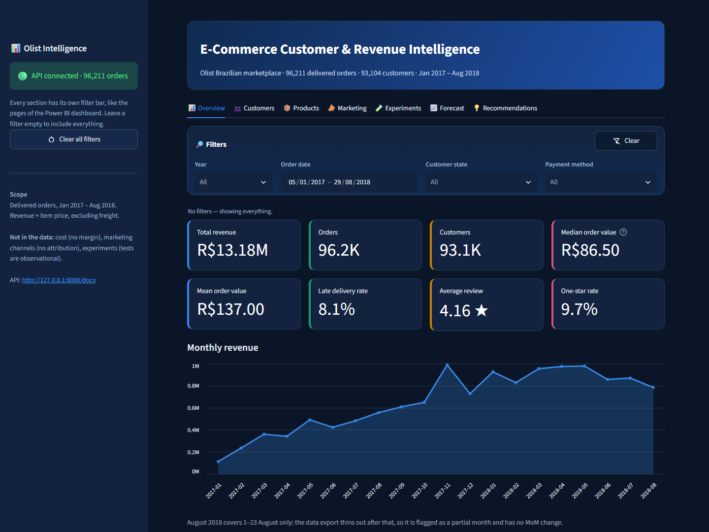
</p>

*Left: the Power BI dashboard. Right: the FastAPI + Streamlit web app. More in [Screenshots](#screenshots).*

---

## Dataset

[Brazilian E-Commerce Public Dataset by Olist](https://www.kaggle.com/datasets/olistbr/brazilian-ecommerce)
(Kaggle `olistbr/brazilian-ecommerce`) — 9 CSVs, ~100k orders placed between September 2016 and
October 2018 on a Brazilian marketplace.

| Table | Rows | Grain |
|---|---:|---|
| `olist_orders_dataset` | 99,441 | one row per order |
| `olist_order_items_dataset` | 112,650 | one row per item line within an order |
| `olist_customers_dataset` | 99,441 | one row per order-scoped customer account |
| `olist_products_dataset` | 32,951 | one row per product |
| `olist_order_payments_dataset` | 103,886 | one row per payment instalment record |
| `olist_order_reviews_dataset` | 99,224 | one row per review (key not unique — see audit) |
| `olist_sellers_dataset` | 3,095 | one row per seller |
| `olist_geolocation_dataset` | 1,000,163 | one row per geocoded observation |
| `product_category_name_translation` | 71 | category name PT → EN |

Raw CSVs live in `data/raw/olist/` and are **git-ignored** — download them from Kaggle and unzip
them there to reproduce.

## Structural limitations of this data

Stated up front because they shape the scope of several phases. The analysis adapts to them and
labels findings accordingly rather than approximating past them.

- **No cost or margin data.** Only `price` and `freight_value`. Profit analysis is impossible;
  product "profitability" is scoped to revenue, price level and revenue concentration.
- **No marketing channel data** — no campaigns, impressions, clicks, spend or attribution. The
  marketing phase uses proxies (payment type, seller, region, category) and states that true
  multi-channel attribution cannot be done here.
- **No experiment or control flag.** The A/B phase uses a natural quasi-experiment and is
  labelled **observational**, not a randomised experiment.
- **No customer demographics** beyond geography (city / state / zip prefix).
- **`customer_id` is order-scoped**; `customer_unique_id` identifies the person and is the key
  used for RFM, repeat-purchase and cohort analysis.

## Key decisions from the data audit

Established in `notebooks/01_data_understanding.ipynb` and binding on every later phase:

1. **Identity** — `customer_unique_id` (96,096 people behind 99,441 `customer_id` values).
2. **Revenue** — `order_items.price` summed over **delivered** orders only; `freight_value`
   tracked separately. R$ 13.22M of R$ 13.59M gross.
3. **Time window** — **Jan 2017 – Aug 2018 (20 months)**. The 2016 pilot period and the truncated
   Sep/Oct 2018 tail are extract artefacts, not demand signals.
4. **Join discipline** — deduplicate reviews to one per order, collapse `geolocation` to one row
   per zip prefix, left-join categories with an `Unknown` bucket.
5. **Truncation** — the export thins from 2018-08-22 and stops 2018-08-29 (found in Phase 12).
   Time-series work trims these days; an earlier "12% decline into August" reading was an artefact
   and was corrected.

## Project structure

```
ecommerce-analytics/
├── data/
│   ├── raw/olist/          # the 9 source CSVs (git-ignored)
│   ├── processed/          # analysis-ready tables + olist.db (git-ignored)
│   └── powerbi/            # 13 dashboard-ready exports, CSV + Parquet (git-ignored)
├── notebooks/
│   ├── 01_data_understanding.ipynb
│   ├── 02_data_cleaning.ipynb
│   ├── 03_eda.ipynb
│   ├── 04_customer_analytics.ipynb
│   ├── 05_rfm_segmentation.ipynb
│   ├── 06_cohort_analysis.ipynb
│   ├── 07_product_analytics.ipynb
│   ├── 08_marketing_analysis.ipynb
│   ├── 09_ab_testing.ipynb
│   └── 10_forecasting.ipynb
├── sql/                    # schema + 28 analytical queries; build_db.py loads SQLite
├── dashboard/              # Power BI project (.pbip): 5 pages, 65 visuals, 38 measures — see dashboard/README.md
├── app/
│   ├── api/                # FastAPI backend: data.py, stats.py, main.py (22 endpoints)
│   └── dashboard/          # Streamlit web app with per-tab filter bars: streamlit_app.py, client.py
├── tests/test_api.py       # 28 tests: the API reproduces the notebook numbers, with and without filters
├── run_app.py              # starts the API and the web app together
├── .streamlit/config.toml  # dark theme matching the Power BI dashboard
├── reports/                # recommendations, SQL results, Power BI data dictionary
├── docs/screenshots/       # Power BI and web app screenshots used in this README
├── src/                    # reusable pipeline code
│   ├── data_cleaning.py    # cleaning rules + fact-table builders
│   ├── feature_engineering.py
│   ├── forecasting.py      # diagnostics, model ladder, tail trimming
│   ├── export_powerbi.py   # builds data/powerbi/
│   ├── build_pbip.py       # generates + schema-validates the Power BI project
│   └── viz.py              # shared chart styling
├── requirements.txt
└── README.md
```

## Phases

| # | Phase | Deliverable | Status |
|---|---|---|---|
| 1 | Business understanding | questions, KPIs, scope | Done |
| 2 | Data selection & understanding | `01_data_understanding.ipynb` | Done |
| 3 | Data cleaning | `02_data_cleaning.ipynb`, `src/data_cleaning.py`, 10 processed tables | Done |
| 4 | Exploratory analysis | `03_eda.ipynb` | Done |
| 5 | Advanced SQL analytics | `sql/*.sql` (28 queries), `sql/build_db.py` | Done |
| 6 | Customer analytics & RFM | `04_customer_analytics.ipynb`, `05_rfm_segmentation.ipynb` | Done |
| 7 | K-Means segmentation | `05_rfm_segmentation.ipynb` §3–4 | Done |
| 8 | Cohort & retention analysis | `06_cohort_analysis.ipynb` | Done |
| 9 | Product & category analytics | `07_product_analytics.ipynb` | Done |
| 10 | Marketing proxy analysis | `08_marketing_analysis.ipynb` | Done |
| 11 | Quasi-experiment & statistics | `09_ab_testing.ipynb` | Done |
| 12 | Revenue forecasting | `10_forecasting.ipynb`, `src/forecasting.py` | Done |
| 13 | BI dashboard | `dashboard/OlistIntelligence.pbip`, `src/build_pbip.py` | Done |
| 14 | Recommendations report | `reports/business_recommendations.md` | Done |
| 15 | Web app (FastAPI + Streamlit) | `app/`, `run_app.py`, `tests/test_api.py` | Done |

## Setup

```bash
python -m venv venv
venv\Scripts\activate          # Windows
pip install -r requirements.txt

# place the 9 Kaggle CSVs in data/raw/olist/, then:
jupyter notebook notebooks/01_data_understanding.ipynb
```

Notebooks resolve data with a relative path (`../data/raw/olist`), so run them from `notebooks/`.

## Tech stack

Python (pandas, NumPy) · Matplotlib · **SQLite** (CTEs, window functions — see note) ·
SciPy & statsmodels (hypothesis testing, confidence intervals, effect size, ARIMA/SARIMA,
Holt-Winters) · scikit-learn (K-Means) · Power BI · FastAPI + Streamlit (web app) · pytest

**On the database:** PostgreSQL is not installed on the development machine, so the analytical
layer runs on **SQLite 3.50**, which supports every construct the project needs — CTEs, window
functions (`ROW_NUMBER`, `RANK`, `DENSE_RANK`, `NTILE`, `LAG`, `LEAD`, `FIRST_VALUE`, `LAST_VALUE`,
`SUM`/`AVG OVER` with `PARTITION BY` and explicit frames). The queries are ANSI-standard; the only
engine-specific syntax is `julianday()` for date differencing, which becomes plain date subtraction
on PostgreSQL. [`sql/build_db.py`](sql/build_db.py) loads the cleaned tables into SQLite, runs
`ANALYZE` so the query planner handles the multi-table views efficiently, then runs every query.
Each query in the `.sql` files starts with a `-- name:` line, which the runner uses to split and
label them.


## Headline findings

1. **This is an acquisition business, not a retention business.** 97.0% of customers buy exactly
   once, and **98.2% of every cohort's revenue arrives in its acquisition month**.
2. **Revenue is driven by unit price, not basket size.** Average unit price explains **87%** of
   order-value variance; basket size explains 2.4%. 90% of orders contain a single item.
3. **Late delivery is the strongest relationship in the data** — a 1-star rate of **46.2% vs 6.6%**
   (7.0×, χ² = 12,573, Cramér's V = 0.363) — but its retention value is negligible (~R$5,000/yr).
4. **The apparent cohort collapse is censoring**, not deterioration: naive repeat rates correlate
   **r = 0.92** with observation time; on an equal 3-month window 2017 and 2018 cohorts differ by
   −0.001 pp.
5. **Trend-extrapolating forecasts fail badly** (150–210% worse than naive). A 3-month moving
   average wins at MAPE 7.13%. Plan flat, ~R$850k/month.
6. **Growth was 100% volume-driven** — Jan–Aug 2018 vs 2017: revenue +141%, orders +140%,
   **AOV +0.5%**.

See [`reports/business_recommendations.md`](reports/business_recommendations.md) for the full set,
each traced to the notebook that produced it.

## Screenshots

### Power BI dashboard — `dashboard/OlistIntelligence.pbip`

Five pages with a shared page navigator and slicers on every page. Design and verification notes
are in [`dashboard/README.md`](dashboard/README.md).

| Executive Overview | Customer Intelligence |
|---|---|
|  | 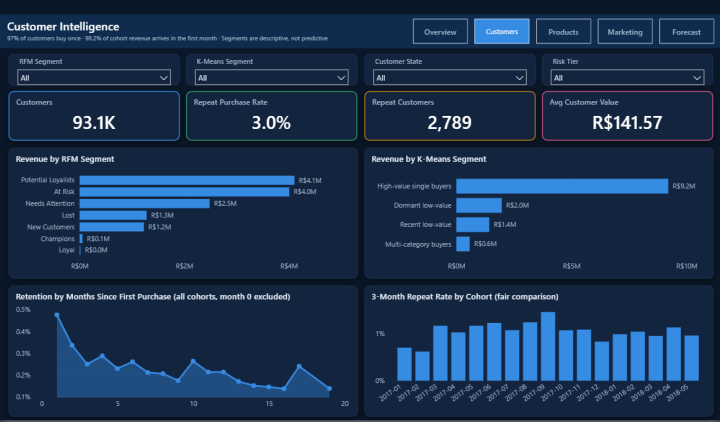 |
| **Product Intelligence** | **Marketing Proxies** |
| 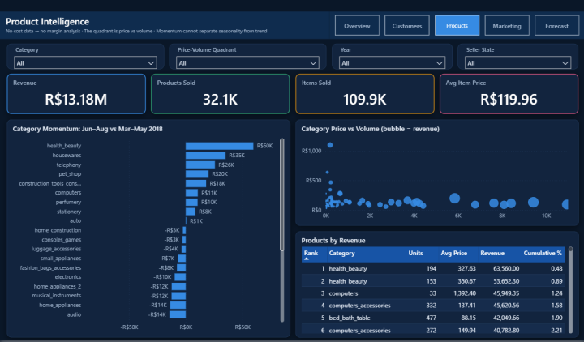 | 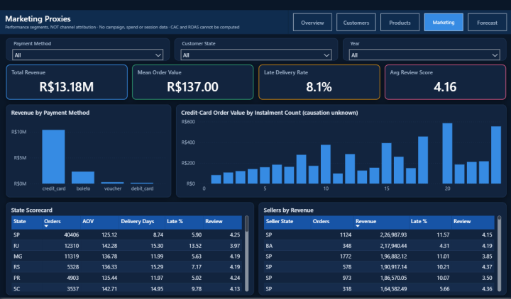 |
| **Revenue Forecast** | |
| 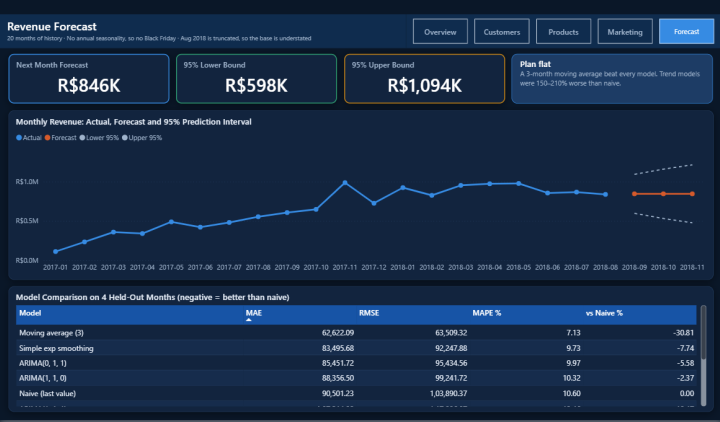 | |

### Web app — FastAPI + Streamlit

Seven tabs, each with its own filter bar (see [Web app](#web-app-fastapi--streamlit)).

| Overview, no filters | Overview filtered to 2018, São Paulo + Rio de Janeiro |
|---|---|
|  | 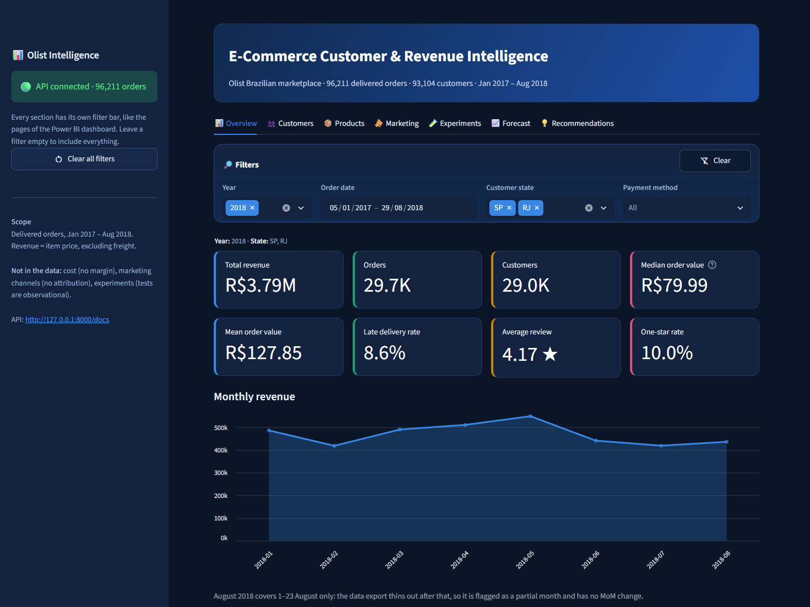 |
| **Customers** | **Products** |
| 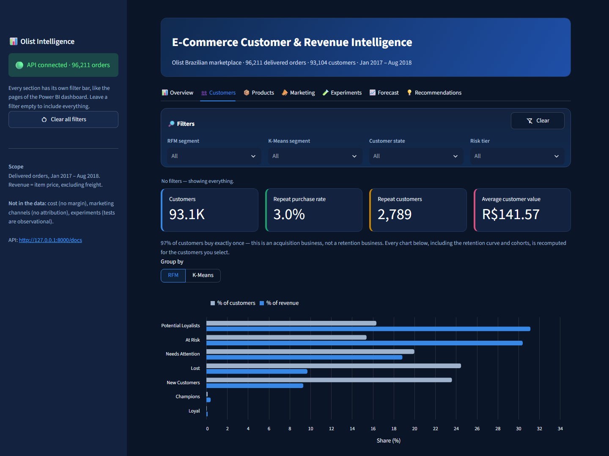 | 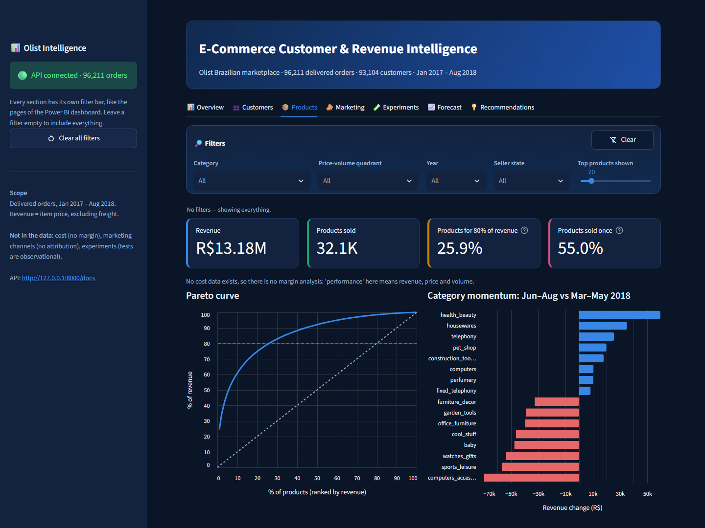 |
| **Marketing** | **Experiments** |
| 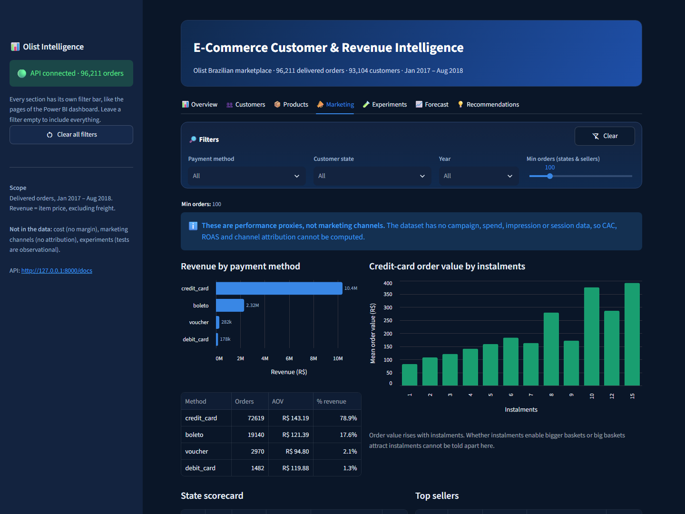 | 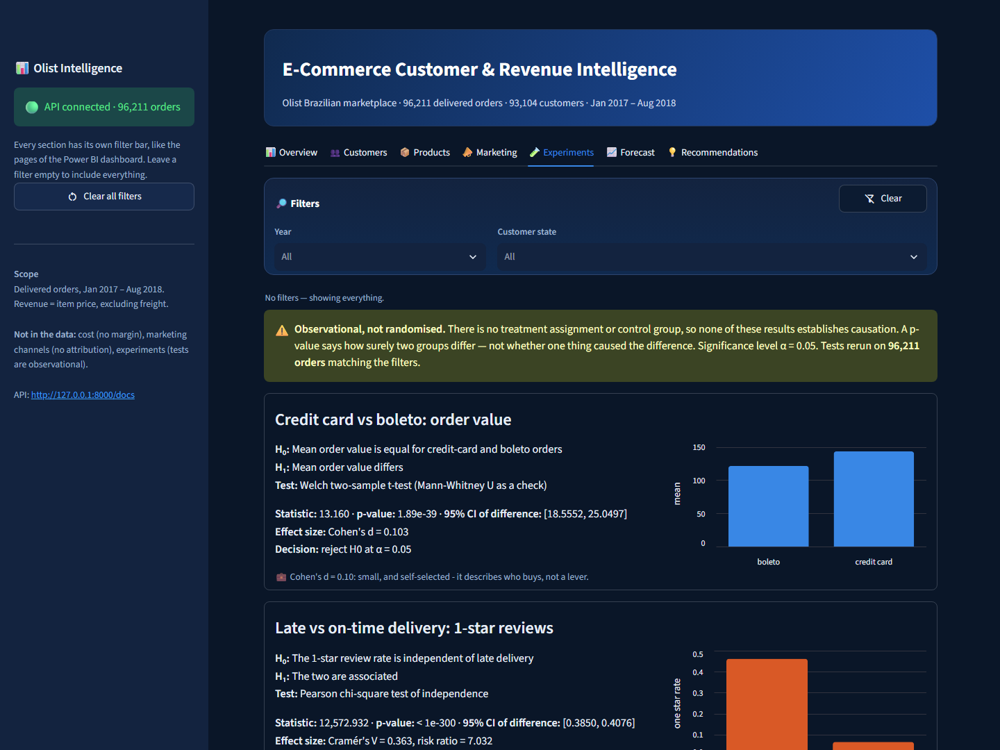 |
| **Forecast** | |
| 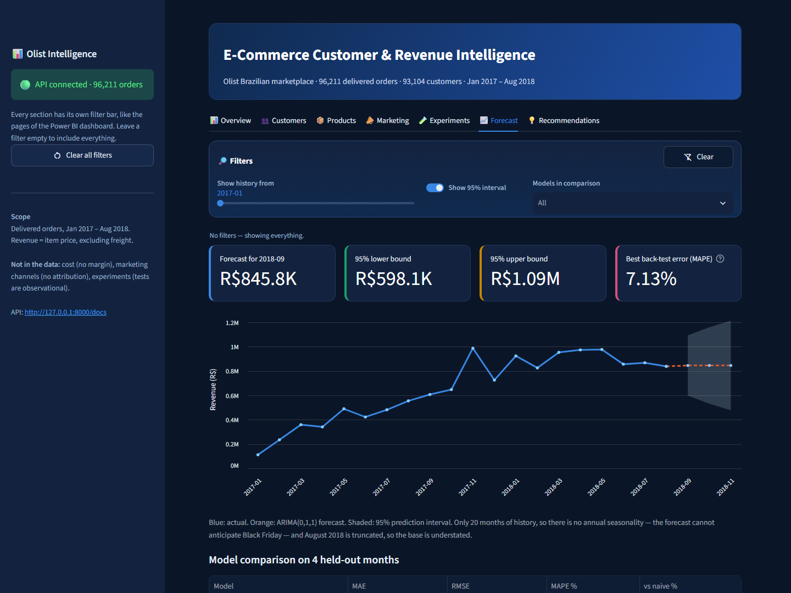 | |

## Notebook guide

The notebooks contain code and outputs only. This section explains what each one does, the
method choices behind it, and what it found. Section numbers (§) match the order of the code
cells in each notebook and are the numbers cited in `reports/business_recommendations.md`.

Analysis base for notebooks 03–10: **delivered orders, 2017-01-01 to 2018-08-31** — 96,211 orders,
R$13,181,027 revenue, 93,104 customers.

### 01 — Data understanding (Phase 2)

A read-only audit of the 9 raw CSVs; nothing is modified.

**Sections:** §1 load · §2 inventory · §3 schema · §4 missing values · §5 duplicates · §6 key
cardinality · §7 date coverage · §8 referential integrity · §9 value sanity · §10 order timeline ·
§11 payment reconciliation · §12 category translation · §13 geography · §14 issue register ·
§15 conclusions

**Findings**
- `customer_id` is order-scoped: 99,441 ids are 96,096 people. Using it would report a 0% repeat
  rate by construction.
- Usable window is 20 months: 2016 is a pilot (4 / 324 / 1 orders, Nov 2016 empty) and Sep–Oct 2018
  is truncated (16 and 4 orders).
- `review_id` is not unique (789 repeat; 547 orders have >1 review, 202 with conflicting scores).
- `geolocation` has 261,831 exact duplicate rows and 8,011 city spellings.
- Zero orphaned foreign keys; payments reconcile to item totals for 99.4% of orders; no negative
  or zero prices.
- 16 issues logged in the §14 register with a severity and a Phase 3 decision for each.

### 02 — Data cleaning (Phase 3)

Implements the §14 register. Logic lives in `src/data_cleaning.py`; the notebook runs and checks it.

**Sections:** §1 dtypes · §2 invalid dates · §3 invalid values and payments · §4 outliers · §5 missing
values · §6 categories · §7 duplicates · §8 orphans · §9 fact tables · §10 validation · §11 quality
report · §12 write outputs · §13 summary

**Rules:** flag rather than delete; remove rows only when they would corrupt a join (duplicate
reviews, the geolocation fan-out, out-of-Brazil coordinates); nothing is mean/median-imputed.

**Key decisions**
- **No price outliers removed.** The IQR fence (R$277.40) flags 8,427 lines — 7.5% of rows but
  35.6% of revenue, across 3,715 products that recur (the top one sold 195 times). They are a real
  high-value tier, not errors.
- **Negative stage durations** (1,382 orders) are nulled and flagged; raw timestamps are kept.
- **Reviews** deduplicated to the latest per order; mean score moves by less than 0.0001.
- **Geolocation** collapsed from 1,000,163 rows to 19,010 (median lat/lng per zip).
- **2 untranslated categories** translated manually; 610 uncategorised products bucketed as
  `unknown` (R$179,535).
- **2017-09-19 cluster:** 282 deliveries against ~130/day, including 21 of the 64 slowest orders.
  Kept; backlog clearance and data backfill cannot be told apart from this data.
- **Validation (§10):** 12/12 checks pass; revenue preserved to the cent at both grains.

### 03 — Exploratory data analysis (Phase 4)

**Sections:** §1 univariate (1.1 order value, 1.2 customer spend, 1.3 basket size) · §2 bivariate
(2.1 basket vs value, 2.2 spend vs frequency, 2.3 category, 2.4 region, 2.5 delivery vs satisfaction)
· §3 time series (3.1 weekday/hour) · §4 anomalies · §5 findings

**Findings**
- Order value is heavily skewed (skew 9.9): mean R$137.00, median R$86.50, 70.8% of orders below
  the mean. AOV is always quoted with the median.
- Unit price explains 87% of order-value variance, basket size 2.4%; 90.0% of orders are single-item.
- Top 10% of customers = 41.1% of revenue (not 80/20).
- Repeat buyers have a lower AOV than one-time buyers (R$122.95 vs R$137.91).
- São Paulo is 42% of orders but has the lowest AOV (R$125.12); remote states run higher.
- Late delivery: 46.2% one-star vs 6.6% on time.
- Jan–Aug 2018 vs 2017: revenue +141.1%, orders +139.9%, AOV +0.5% — growth is all volume.
- Black Friday (24 Nov 2017): 7.8× a median day, at a below-average AOV.
- **Correction:** the apparent August 2018 decline is a truncation artefact (see notebook 10 §1).

### 04 — Customer analytics (Phase 6)

**Sections:** §1 customer table · §2 value distribution · §3 frequency and repeat behaviour · §4 churn
risk (4.1 definition, 4.2 lapse threshold) · §5 experience vs return · §6 geography · §7 save · §8
findings

**Method:** one row per `customer_unique_id`; recency measured to 2018-09-01. Churn is redefined as
second-purchase failure because there is no contract to cancel; the lapse threshold (237 days) is
the 90th percentile of observed repurchase gaps.

**Findings**
- 97.0% buy once; repeat buyers are 5.5% of revenue.
- 50.2% of repurchases happen within 30 days and 35.5% within 7 — likely partly split shopping
  intent, which the data cannot separate.
- A late first delivery lowers the repeat rate from 3.03% to 2.60%, but even a 5-star first order
  returns only ~3.3% of the time: the low repeat rate is structural.
- Caveat: recency is confounded with opportunity at a fixed window close.

### 05 — RFM and K-Means segmentation (Phases 6–7)

**Sections:** §1 RFM scoring (1.1 inputs, 1.2 R and M quintiles, 1.3 frequency, 1.4 consequence) · §2
segment rules · §3 K-Means (3.1 features, 3.2 choosing k, 3.3 profiles) · §4 RFM vs K-Means · §5 save
· §6 findings

**RFM scoring**
- R and M: equal-count quintiles (R reversed, 5 = most recent).
- F: quintiles are impossible (97% have one order, so `qcut` returns one bin). Rule-based instead:
  1 order → 1, 2 orders → 3, 3+ orders → 5.

| Segment | Rule (first match wins) |
|---|---|
| Champions | F≥5, R≥4, M≥4 |
| Loyal | F≥5, R≥3 |
| At Risk | F≥5 with lower R, **or** R≤2 with M≥4 |
| Potential Loyalists | R≥4, M≥4 |
| New Customers | R≥4 |
| Needs Attention | R=3 |
| Lost | everything else |

**K-Means:** features recency, frequency, monetary, AOV, category count; skewed features log1p
transformed, then standardised. k=2 has the best silhouette (0.73) but is a degenerate split on
"bought in more than one category"; k≥3 all score ~0.34–0.36 (weak structure). **k=4 was chosen for
interpretability**, not because the data demands it.

**Findings**
- Potential Loyalists (31.2%) and At Risk (30.4%) hold 61.6% of revenue; Champions + Loyal are 156
  customers (0.55%).
- "High-value single buyers" = 37% of customers, 69.8% of revenue.
- Agreement ARI 0.36 / NMI 0.43. Champions and Loyal map 100% to the multi-category cluster;
  "Needs Attention" splits ~50/50, a weakness of recency-only rules.
- Segments are descriptive, not predictive.

### 06 — Cohort and retention (Phase 8)

**Sections:** §1 cohort sizes · §2 retention matrix · §3 decay · §4 censoring check · §5 revenue
retention · §6 save · §7 findings

**Findings**
- Month-1 retention averages 0.48%, month 3 0.25%, then flat near 0.2%.
- 98.2% of cohort revenue arrives in the acquisition month.
- The naive "repeat rate is collapsing" view (7.2% → 0.6%) is **censoring**: it correlates r = 0.92
  with months observed. On an equal 3-month window, 2017 H1 cohorts repeat at 0.978% and 2018 cohorts
  at 0.976% — no decline.
- Revenue per customer is stable across cohorts (R$131–R$160) while cohort size grew 8×.

### 07 — Product analytics (Phase 9)

**Scope:** no cost data exists, so no margin analysis. The margin-vs-volume quadrant is replaced by
a price-vs-volume quadrant, and "worst performer" means "sells little", never "loses money".

**Sections:** §1 best sellers · §2 worst performers · §3 Pareto · §4 price-vs-volume quadrant · §5
category momentum · §6 freight share · §7 save · §8 findings

**Findings**
- 80% of revenue needs 25.9% of products (80/26, not 80/20) and 18 of 74 categories.
- 55% of products sold once, yet carry 21.5% of revenue.
- Jun–Aug vs Mar–May 2018: health_beauty +22%, housewares +25%, telephony +43%, pet_shop +46%;
  computers_accessories −36%, baby −39%, cool_stuff −45%, office_furniture −55%. Seasonality cannot
  be separated from trend with one year of data.
- Freight is 16.6% of revenue and falls hardest on cheap, bulky goods (r = −0.75 with price).

### 08 — Marketing analysis (Phase 10)

> **This is NOT multi-channel marketing attribution.** The dataset has no campaign, channel, spend,
> impression, click or session data, so CAC, ROAS, channel mix and conversion rate cannot be
> computed. The analysis uses performance proxies — payment method, instalments, region, seller.

**Sections:** §1 payment method · §2 instalments · §3 region · §4 sellers · §5 regional category mix ·
§6 data needed for real attribution · §7 save · §8 findings

**Findings**
- Credit card: 75.5% of orders, 78.9% of revenue, AOV 18% above boleto.
- Credit-card AOV rises ~4× with instalment count (R$82.89 at 1x → R$322.07 at 11x+). Whether
  instalments enable bigger baskets or big baskets attract instalments cannot be resolved here.
- São Paulo: fastest (8.7 days), happiest (4.25), cheapest (R$125.12). Bahia: 19.3 days, 14.1% late,
  3.93 stars, R$151.66.
- Seller late rates vary widely and correlate negatively with review score.

**Data needed for real attribution (§6):** a session log with channel/source/campaign, a
visitor-to-customer mapping, a campaign spend table, and randomised holdouts.

### 09 — Quasi-experiment and statistical testing (Phase 11)

> **These comparisons are observational, not randomised.** There is no treatment flag or control
> group. Group membership is chosen by the customer or by circumstance, so a significant difference
> shows the groups differ, not that one variable caused the difference.

**Sections:** §1 Test 1 · §2 Test 2 · §3 Test 3 · §4 confound checks · §5 statistical vs business
significance · §6 findings and limitations. Significance level α = 0.05 for every test.

| Test | H₀ | Method | Result | Effect size | Verdict |
|---|---|---|---|---|---|
| 1. Credit card vs boleto order value | equal means | Welch t (+ Mann-Whitney, log-scale t) | R$21.80 diff, 95% CI [18.56, 25.05], p = 1.9e-39 | d = 0.10 (small) | significant, not actionable |
| 2. Late vs on-time 1-star rate | independent | chi-square | 46.2% vs 6.6%, p < 1e-300 | Cramér's V = 0.36 (large) | significant and important |
| 3. Late first order vs repeat rate | equal proportions | two-proportion z | 2.51% vs 3.04%, p = 0.010 | h = 0.03 (negligible) | significant, economically trivial |

- Test 1 survives stratification by state and by basket size, so it is a unit-price difference.
- With ~90,000 orders the minimum detectable difference is R$4.79, so p-values mostly reflect
  sample size. Effect sizes and confidence intervals carry the decision.
- Test 3 is worth roughly R$5,000 a year.
- Limitations: unobserved confounders (income, credit access, preference); lateness is not random,
  so 7× is an upper bound; three tests at α = 0.05 (all survive Bonferroni).

### 10 — Revenue forecasting (Phase 12)

**Sections:** §1 truncated tail · §2 diagnostics · §3 monthly models · §4 daily models · §5 forecast
with intervals · §6 save · §7 findings and limitations. Code lives in `src/forecasting.py`.

**Method**
- The export thins from 22 August 2018 and stops on 29 August. Trailing days below 50% of the
  28-day median order count are trimmed. On a like-for-like days 1–21 basis, August ran +45.8% above
  July and within 1.5% of May, so the apparent August decline was an artefact.
- Monthly series (20 points): ADF p = 0.18, first difference stationary (d = 1). Annual seasonality
  needs 24+ months, so no seasonal ARIMA is fitted.
- Daily series (596 points after trimming): weekly seasonality confirmed — the differenced ACF
  spikes only at lags 7, 14, 21, 28.

**Findings**
- Monthly: a 3-month moving average wins (MAE R$62,622, MAPE 7.13%, 31% better than naive). Holt,
  Drift and the historical mean are 150–210% worse than naive — trend extrapolation fails because
  growth flattened.
- Daily: Holt-Winters with a 7-day season wins (MAPE 19.3%, 19.4% better than naive).
- ARIMA(0,1,1) forecast ≈ R$846k/month; 95% interval ±29% in month 1, ±44% by month 3.
- Limitations: 20 monthly observations, 4 test months, no Black Friday, no external regressors, and
  a forecast base month (Aug 2018) that is understated.

## SQL guide

`sql/schema.sql` creates 8 tables (orders and order_items as facts; customers, products, sellers and
geolocation as dimensions; payments and reviews as order-level tables) plus two views that fix the
analysis base once, so no query can include cancelled orders or the unusable date edges:
`v_analysis_orders` (one row per delivered in-window order) and `v_analysis_items` (one row per
line, joined to product and seller). Every query keys customers on `customer_unique_id`, and
revenue is `order_items.price` — freight is never summed into it. Results for all 28 queries are
in [`reports/sql_query_results.md`](reports/sql_query_results.md).

| File | Queries | Techniques |
|---|---|---|
| `revenue_analysis.sql` | monthly revenue and growth, YoY on a like-for-like Jan–Aug window, quarterly with LAG/LEAD (2018Q3 flagged as partial), category contribution and Pareto band, revenue by state vs national AOV, top-5 category trends, freight burden by state | `LAG`, `LEAD`, `SUM`/`AVG OVER` with frames, `RANK`, `ROW_NUMBER`, `DENSE_RANK`, `PARTITION BY` |
| `customer_analysis.sql` | top customers (ROW_NUMBER vs RANK vs DENSE_RANK side by side), repeat vs one-time, order frequency, first/last purchase with gaps, repurchase-gap summary, RFM in SQL, revenue by customer decile, new vs returning by month | `NTILE`, `FIRST_VALUE`, `LAST_VALUE`, `LAG` within customer, CTEs |
| `product_analysis.sql` | top products with rank-in-category, single-sale products, category Pareto, price-vs-volume quadrant, price bands, category momentum, seller concentration | window medians via `ROW_NUMBER`, `CASE WHEN` banding |
| `marketing_analysis.sql` | payment method performance, instalment behaviour, regional scorecard, seller performance, top category per state, delivery experience vs repeat purchase | dominant payment per order via `ROW_NUMBER`, partitioned ranks |

Scope notes carried by these queries:
- **Marketing queries are proxies, not attribution** — there is no channel, campaign or spend data,
  so none of them can produce CAC, ROAS or channel ROI.
- **Product queries are revenue, price and volume only** — there is no cost data, so the quadrant
  is price vs volume rather than margin vs volume.
- **RFM frequency is rule-based** (1 / 3 / 5 for 1 / 2 / 3+ orders) because 97% of customers have
  one order and `NTILE` cannot split a near-constant column.
- **Performance:** the top-5 category trend query aggregates first and ranks the aggregate; a
  `JOIN (… ORDER BY … LIMIT 5)` subquery made SQLite re-evaluate it per row and ran for minutes.
  The quadrant medians use window functions for the same reason.

## Web app (FastAPI + Streamlit)

The final layer serves the analysis as a web application in two parts: a **FastAPI** backend that
exposes the results as a JSON API, and a **Streamlit** front end that calls it. They are separate
processes, so the API can also feed other clients, such as a notebook, another dashboard or a
scheduled report.

```bash
python run_app.py
```

This starts the API on port 8000, waits until it is healthy, starts the web app on port 8501, and
opens the browser. Ctrl+C stops both. To run them separately:

```bash
python -m uvicorn app.api.main:app --port 8000
python -m streamlit run app/dashboard/streamlit_app.py
```

- Web app: http://localhost:8501
- Interactive API docs: http://127.0.0.1:8000/docs

### Backend — `app/api/`

- `data.py` loads the analysis-ready tables from `data/powerbi/` once at startup and applies the
  filters: order filters (year, customer state, payment method, date range), item filters
  (category, seller state) and customer filters (state, RFM segment, K-Means segment, risk tier).
  It also recomputes the retention curve and the cohort table for any subset of orders.
- `stats.py` recomputes the three hypothesis tests from notebook 09 live from the data (Welch
  t-test, chi-square, two-proportion z-test), returning hypotheses, test statistic, p-value, 95%
  confidence interval and effect size for each. When a filtered group has fewer than 30 orders,
  the test is reported as insufficient data instead of being run.
- `main.py` defines 22 GET endpoints:

| Group | Endpoints | Filters |
|---|---|---|
| meta | `/health`, `/filters` | — |
| overview | `/kpis`, `/revenue/monthly`, `/revenue/by-state`, `/revenue/by-category` | `year`, `state`, `payment`, `date_from`, `date_to` |
| customers | `/customers/summary`, `/customers/segments?by=rfm\|kmeans`, `/customers/retention`, `/customers/cohorts`, `/customers/top` | `state`, `rfm`, `kmeans`, `risk` |
| products | `/products/summary`, `/products/pareto`, `/products/categories`, `/products/top` | `category`, `quadrant`, `seller_state`, `year` |
| marketing | `/marketing/payments`, `/marketing/installments`, `/marketing/regions`, `/marketing/sellers` | `payment`, `state`, `year`, `min_orders` |
| statistics | `/experiments` | `year`, `state` |
| forecast | `/forecast` | — |
| report | `/recommendations` | — |

Every filter takes several values, like a Power BI slicer, by repeating the parameter:
`/kpis?state=SP&state=RJ&year=2018`. An empty filter means "everything". Unknown values, or
`date_from` after `date_to`, return **422**; a combination with no orders returns **404**. The
monthly revenue endpoint excludes the truncated export tail and flags August 2018 as a partial
month with no MoM change.

### Front end — `app/dashboard/`

Seven tabs, each with its own filter bar at the top, like the pages of the Power BI dashboard.
Each bar has a **Clear** button, a line under it lists the active filters, and the sidebar has
**Clear all filters**. A filter left empty ("All") includes everything.

| Tab | Filters | Content |
|---|---|---|
| Overview | year, order date range, customer state, payment method | 8 KPIs, monthly revenue trend, revenue by category and by state |
| Customers | RFM segment, K-Means segment, customer state, risk tier | repeat-rate KPIs, RFM / K-Means toggle (share of customers vs share of revenue), retention curve and 3-month cohort comparison recomputed for the selected customers, top customers |
| Products | category, price-volume quadrant, year, seller state, number of top products | Pareto KPIs and curve, category momentum, price-vs-volume bubble chart, top products |
| Marketing | payment method, customer state, year, minimum orders | payment methods, credit-card order value by instalments, state scorecard, top sellers — labelled as proxies, not attribution |
| Experiments | year, customer state | the three observational tests, rerun on the filtered orders, with full statistics and a business reading of each |
| Forecast | history start month, 95% interval on/off, models in the comparison | next-month forecast and 95% interval, actual vs forecast chart, model comparison |
| Recommendations | sections, keyword search | the business recommendations report |

The forecast filters only change the view: the forecast itself is fitted once on the full series,
because refitting a model on a filtered slice of 20 months would not be meaningful.

When a filter combination leaves nothing to show, the chart is replaced by a note saying so (for
example, instalments exist only for credit-card orders). It uses the same dark navy theme and
colour-blind-safe palette as the Power BI dashboard. API responses are cached for 10 minutes. If
the API is down, the page says so and shows the command to start it.

### Verification

- `python -m pytest tests/test_api.py` runs 28 tests asserting the API reproduces the notebooks
  exactly: revenue R$13,181,027.13, the filtered totals (2018, São Paulo, boleto), multi-value
  filters (São Paulo + Rio = the sum of the two), the November 2017 date range (R$987,765.37,
  7,289 orders), segment shares, the live retention curve and cohorts (17 comparable cohorts,
  mean 3-month repeat rate 1.04%), the product Pareto (8,310 products for 80% of revenue), the
  state and seller scorecards, all three test statistics and the forecast. It also checks that
  invalid filters are rejected.
- Streamlit's `AppTest` ran the page against the live API: it set filters on every tab, pressed
  each tab's Clear button and the sidebar's Clear all filters, and checked the KPIs after each
  step, with no exceptions.
- All seven tabs were rendered in a headless browser and checked in screenshots.

## Reproducing

```bash
pip install -r requirements.txt

python src/data_cleaning.py          # raw CSVs -> data/processed/ (10 cleaned tables)

# notebooks 01 -> 10, in order; 04-10 also write the analysis tables the steps below need
for nb in notebooks/*.ipynb; do jupyter nbconvert --to notebook --execute --inplace "$nb"; done

python sql/build_db.py --report      # processed -> SQLite + reports/sql_query_results.md
python src/export_powerbi.py         # processed -> data/powerbi/ (13 tables)
python src/build_pbip.py --validate  # -> dashboard/OlistIntelligence.pbip, schema-checked
python -m pytest tests/              # API reproduces the notebook numbers
python run_app.py                    # web app on http://localhost:8501
```

The notebooks must run before the Power BI export: segments, cohorts, product and marketing
tables and the forecast are produced by notebooks 04–10, and `export_powerbi.py` stops with a
message naming the missing notebooks if they have not run. Opening the notebooks in Jupyter and
running 01 → 10 works just as well as the loop above.

This sequence was run end to end from the raw CSVs in a fresh copy of the project: all 21
processed tables and all 13 Power BI exports came out identical to the project's, every
notebook printed the same results, the generated Power BI report was identical (the model
differs only in the `DataFolder` path), and all 28 tests passed.

## Scope boundaries

Stated in this README rather than worked around: **no cost data** (so no margin or profit analysis),
**no marketing channel data** (so no attribution, CAC or ROAS), **no experiment or control group**
(so Phase 11 is observational, never causal), **no demographics** beyond geography, and **one year
of usable history** (so seasonality cannot be separated from trend, and the forecast has no annual
component).
